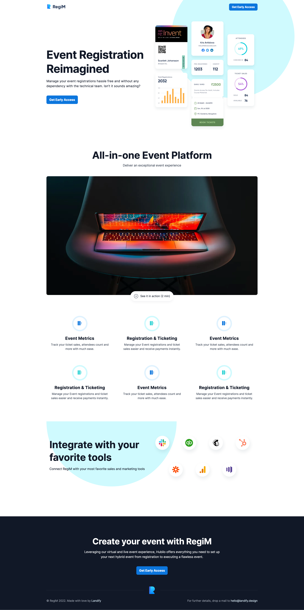

# LandingPage

Responsive Design Landing Page Template

<table>
  <thead>
    <tr>
      <th>Desktop</th>
      <th>Tablet</th>
      <th>Mobile</th>
    </tr>
  </thead>
  <tbody>
    <tr>
      <td style="vertical-align: top;"></td>
      <td style="vertical-align: top;"></td>
      <td style="vertical-align: top;"></td>
    </tr>
  </tbody>
</table>

## Reference

- [Figma](<https://www.figma.com/file/BWHRkbAIXTTWCUESi3pIzm/RegiM---Early-Access-Landing-Page-Template-(Community)?node-id=2554%3A454>)
